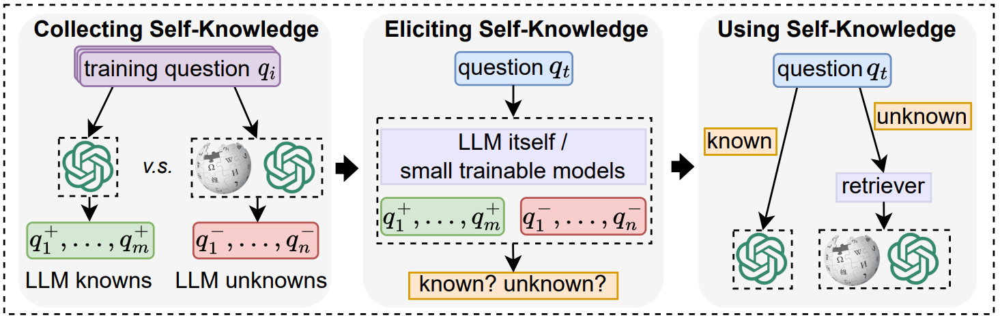

# Method Overview

# Data
The Temporal dataset we use is in the fold `data/`.

# Steps
For SKR_prompt and SKR_icl, we use the prompts shown in the paper to elicit the self-knowledge of the dev data directly.

For SKR_cls, we use the training data and train a [BERT classifier](https://github.com/huggingface/transformers/tree/main/examples/pytorch/text-classification) to elicit the self-knowledge of the dev data. We use the settings with `lr=2e-5` and `epochs=10`.

For SKR_knn, the steps are as follows.
- cd `source/` , collect the self-knowledge of the training data, run `skr.py` and get the `train_skr.json` file.
- run `knn.py` to use the self-knowledge to the dev data and get the `dev_skr_knn.json` file.
- run `eval_skr.py` to evaluate the results.

# Acknowledgement
[Rethinking with Retrieval](https://github.com/HornHehhf/RR)
